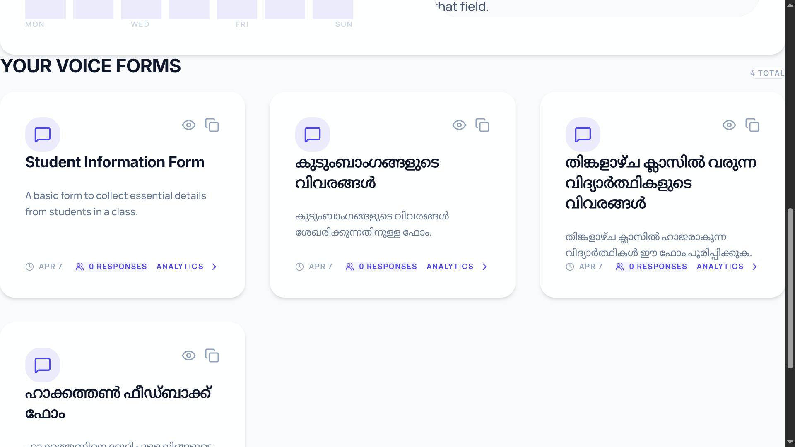
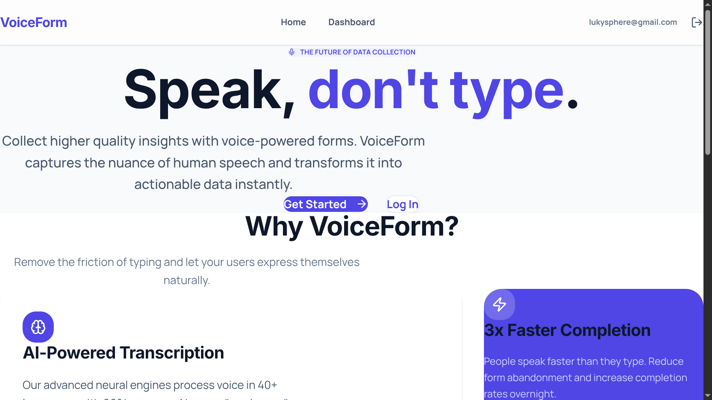
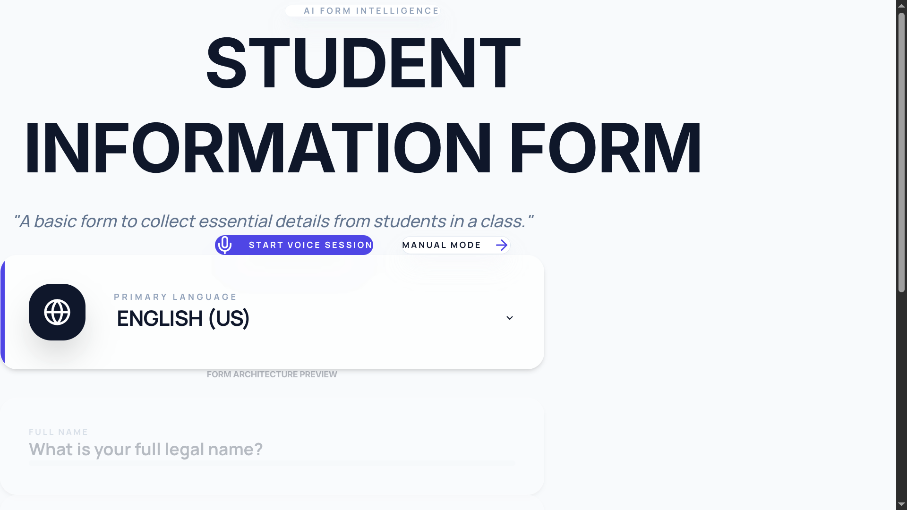
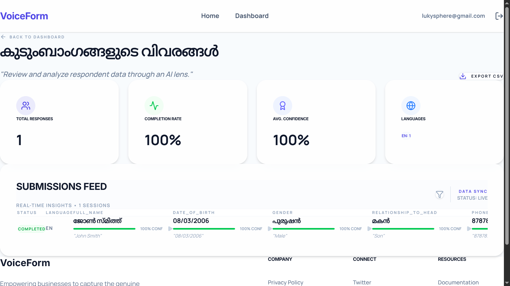

# VoiceForm 🎙️

## Problem Statement
Traditional static forms are high-friction and exclusionary. Millions of users—especially in non-English speaking regions—struggle with typing, small touch-targets, and foreign languages. This leads to high abandonment rates and poor data quality. For businesses, capturing the "true voice" and emotion of a customer is impossible through a radio button.

## Project Description
**VoiceForm** is a conversational, multilingual AI platform that transforms forms into natural human interactions. 

**How it works:**
1. **AI Generation**: Creators describe their goal (e.g., "Post-surgery patient check-in"). Gemini generates a clinical-grade field schema.
2. **Empathetic Voice Loop**: Respondents don't "fill" the form; they talk to it. The system uses Text-to-Speech to ask questions and Speech-to-Text to listen.
3. **Intent Extraction**: Gemini processes the raw transcript to extract structured data (e.g., extracting "I feel a bit of a sharp pain in my lower back" as `severity: moderate`, `location: lower_back`).
4. **Insight Dashboard**: Responses are automatically translated back to the creator's language and summarized using AI sentiment analysis.

---

## Google AI Usage
### Tools / Models Used
- **Gemini 3.1 Flash Lite Preview (Gemini API)**: Our primary engine for reasoning, clinical-grade schema generation, and high-accuracy multilingual data extraction.
- **Vertex AI Text-to-Speech (Studio & Neural2)**: Powering our empathetic personality with ultra-high-fidelity voices (specifically the `en-US-Studio-Q` model) and SSML-driven speech patterns for natural pauses.
- **Gemini CLI (Coding Agent)**: Used throughout the development process for rapid prototyping, complex UI refactoring, and backend orchestration.
- **Web Speech API**: Client-side Speech-to-Text for real-time transcription.

### How Google AI Was Used
AI is the heartbeat of VoiceForm, integrated across the entire lifecycle:
- **Zero-Config Form Building**: Using the **Gemini 3.1 Flash Lite** model via the `google-genai` SDK, VoiceForm acts as a senior UX researcher, designing validated question flows from a single sentence.
- **Natural Language Understanding**: We leverage Gemini's large context window and reasoning to "read" spoken transcripts. It extracts structured fields even when users correct themselves mid-sentence.
- **Empathetic Interaction Design**: Using **Vertex AI TTS** with SSML markup, we've designed a "breath-aware" speaking model. The AI adds a 400ms pause after acknowledgments to simulate active listening.
- **Multilingual Transformation**: Gemini handles the complex task of translating forms into Hindi, Malayalam, and Spanish while preserving the "warm and caring" tone instructed in its system prompt.
- **Accelerated Development**: The entire frontend refactor and backend logic were orchestrated using the **Gemini CLI**, enabling us to build a production-grade prototype in record time during the hackathon.

---

## Proof of Google AI Usage
The following screenshots demonstrate the integration of Gemini 3.1 Flash Lite for schema generation and data extraction:



---

## Screenshots 
  



---

## Demo Video
[Watch Demo](https://drive.google.com/file/d/your-shared-link-here)
Link : https://drive.google.com/file/d/1cjCV6NJT1eD8URbJc6h5PvgtrXiUxfo3/view?usp=drive_link
---

## Configuration

The project requires environment variables for both the backend and frontend. You can find templates in the `.env.example` files within each directory.

### Backend (`server/.env`)
Create a `.env` file in the `server` directory:
```env
SUPABASE_URL=your_supabase_url
SUPABASE_KEY=your_supabase_anon_key
GEMINI_API_KEY=your_gemini_api_key
PORT=8000
gcp-key=YOUR_VERTEX_AI_TTS_CREDENTIALS # Path to your GCP JSON key file
```

### Frontend (`client/.env`)
Create a `.env` file in the `client` directory:
```env
VITE_SUPABASE_URL=your_supabase_url
VITE_SUPABASE_ANON_KEY=your_supabase_anon_key
VITE_BACKEND_URL=http://localhost:8000
```

---

## Installation Steps

```bash
# Clone the repository
git clone https://github.com/Sabari-Vijayan/VoiceForm.git

# Go to project folder
cd VoiceForm

# Setup Backend (FastAPI)
cd server
python -m venv venv
source venv/bin/activate
pip install -r requirements.txt
./run.sh

# Setup Frontend (React + Vite)
cd ../client
npm install
npm run dev
```
